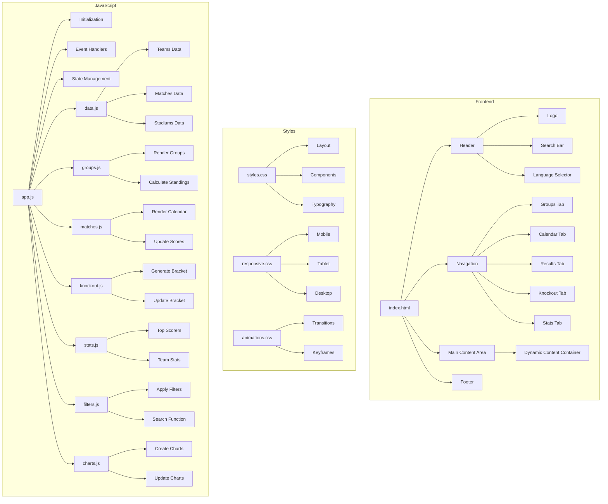
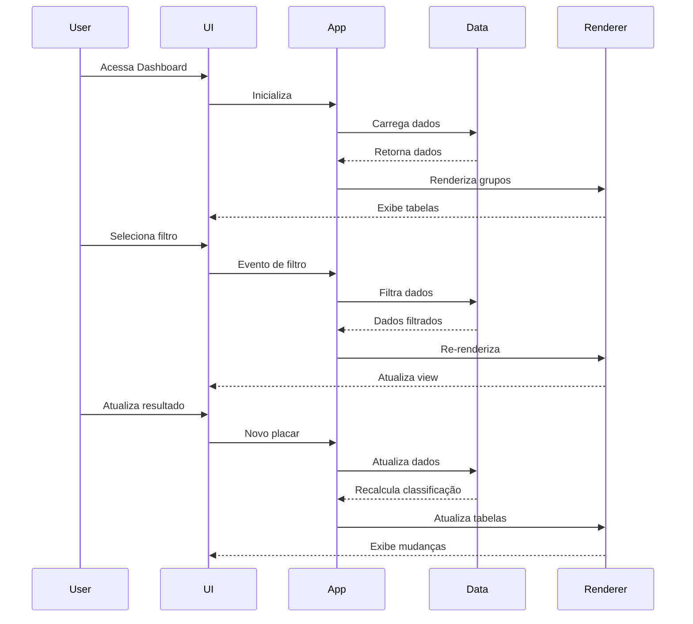
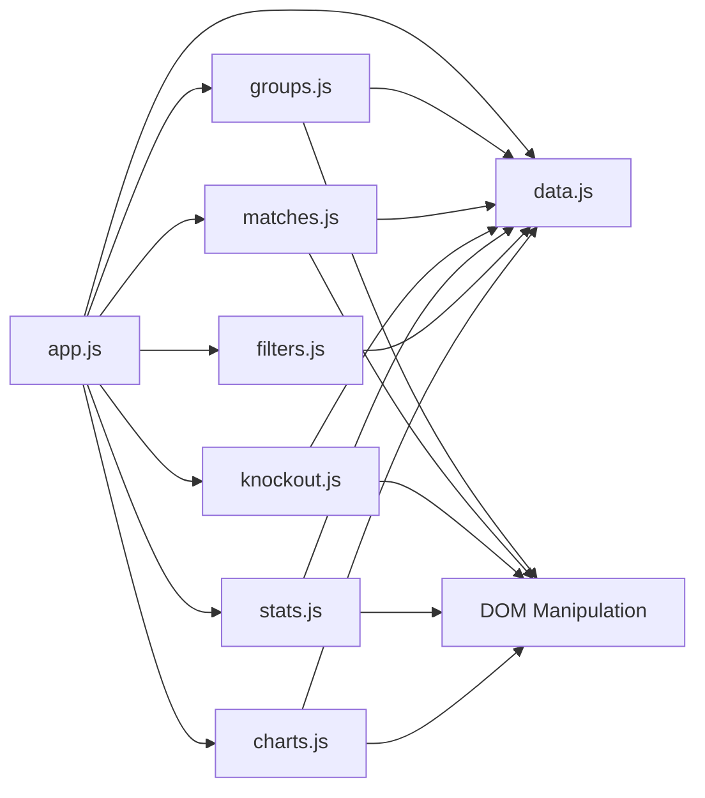
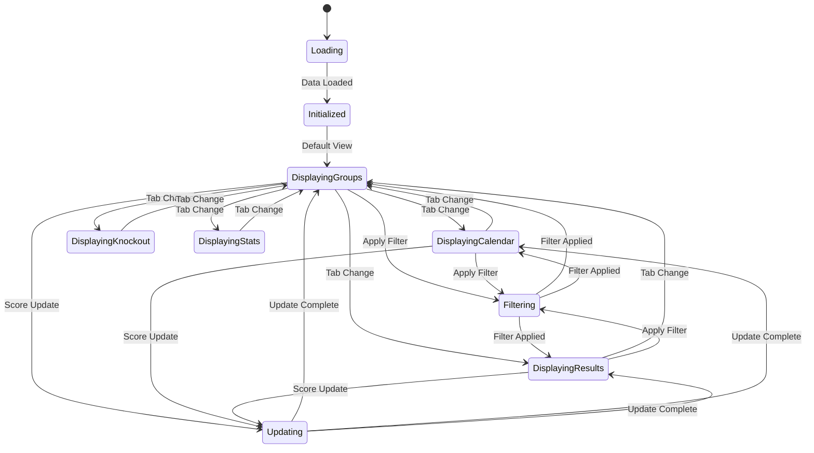
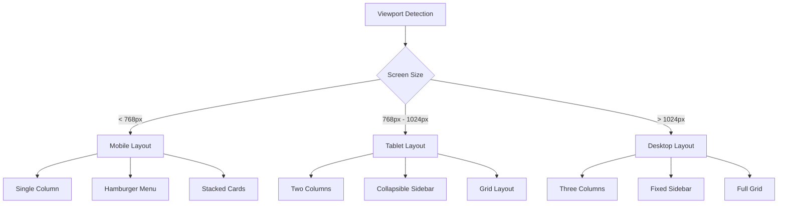
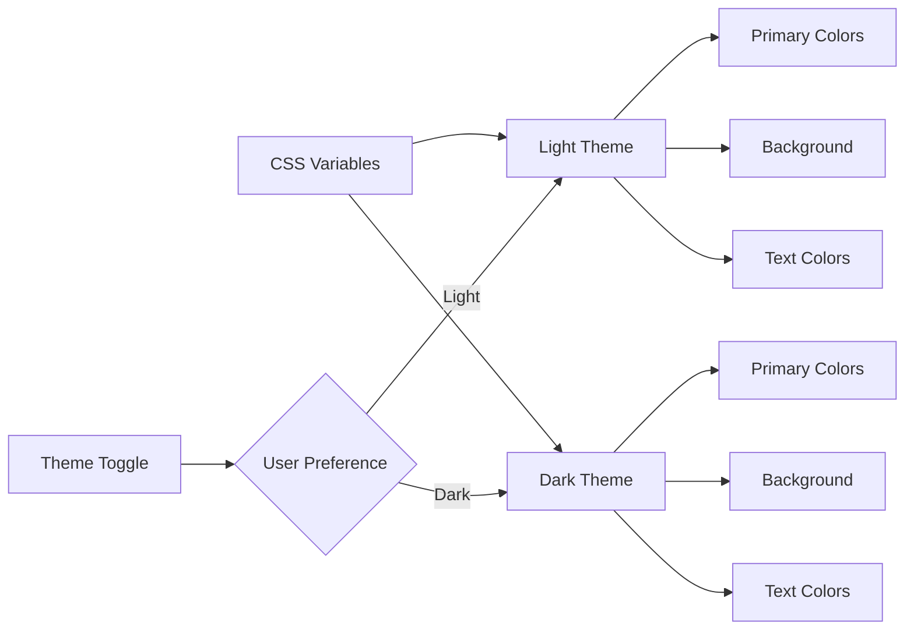
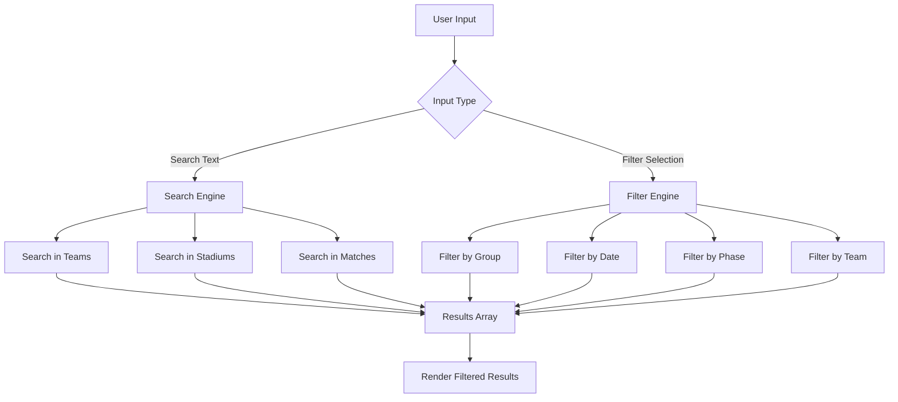

# Arquitetura do Dashboard Copa 2026

## 🏗️ Diagrama de Componentes



## 📊 Fluxo de Dados



## 🎯 Estrutura de Módulos JavaScript



## 🔄 Ciclo de Vida da Aplicação



## 📱 Responsividade



## 🎨 Sistema de Temas



## 🔍 Sistema de Busca e Filtros



## 📈 Gerenciamento de Estado

```javascript
// Estado Global da Aplicação
const AppState = {
  currentView: 'groups',        // groups, calendar, results, knockout, stats
  selectedGroup: null,          // A-L ou null para todos
  selectedTeam: null,           // Código do time ou null
  selectedDate: null,           // Data específica ou null
  selectedPhase: 'all',         // all, group, round16, quarter, semi, final
  searchQuery: '',              // Texto de busca
  matches: [],                  // Array de jogos
  teams: [],                    // Array de seleções
  groups: [],                   // Array de grupos
  standings: [],                // Classificação calculada
  topScorers: [],              // Artilheiros
  filters: {
    active: false,
    criteria: {}
  }
}
```

## 🎯 Prioridades de Implementação

### Fase 1: Core (Essencial)
1. Estrutura HTML básica
2. CSS para layout responsivo
3. Dados estáticos (grupos, seleções, jogos)
4. Renderização de tabelas de grupos
5. Calendário de jogos

### Fase 2: Interatividade
6. Sistema de navegação por abas
7. Filtros básicos (grupo, data)
8. Busca por seleção
9. Atualização de resultados

### Fase 3: Avançado
10. Fase eliminatória visual
11. Estatísticas detalhadas
12. Gráficos com Chart.js
13. Animações e transições

### Fase 4: Polimento
14. Otimizações de performance
15. Testes de responsividade
16. Acessibilidade (ARIA labels)
17. PWA features (opcional)

---

**Próximo Passo**: Iniciar implementação com o modo Code para criar os arquivos do dashboard.