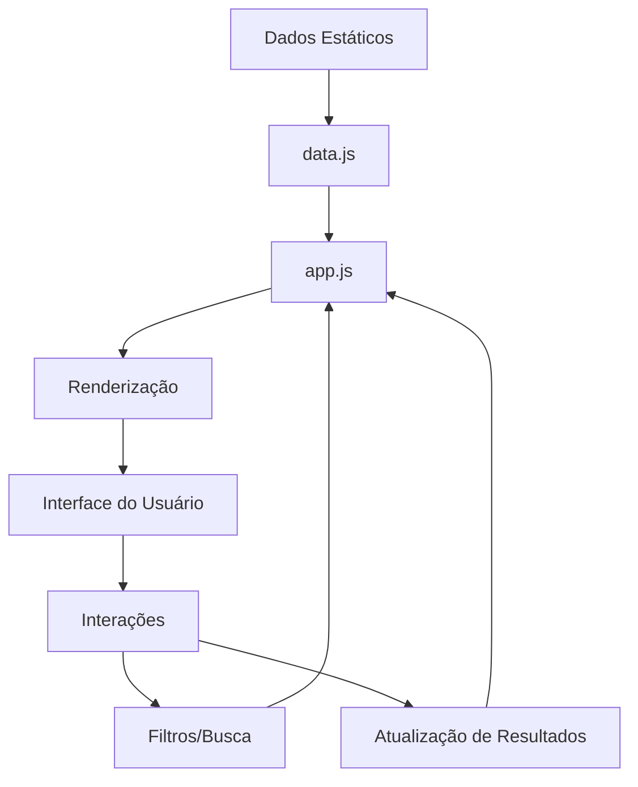

# Dashboard Copa do Mundo FIFA 2026 - Plano Técnico

## 📋 Visão Geral do Projeto

Dashboard web interativo e completo para acompanhamento da Copa do Mundo FIFA 2026, que será realizada nos Estados Unidos, Canadá e México com formato expandido de 48 seleções.

## 🏆 Informações do Torneio

### Formato da Competição
- **48 seleções** divididas em **12 grupos** (4 times por grupo)
- **Fase de Grupos**: 3 jogos por seleção (todos contra todos no grupo)
- **Classificação**: Os 2 melhores de cada grupo + 8 melhores terceiros colocados (32 times)
- **Fase Eliminatória**: Oitavas, Quartas, Semifinais e Final

### Período do Torneio
- **Início**: 11 de junho de 2026
- **Final**: 19 de julho de 2026
- **Total de jogos**: 104 partidas

### Sedes
- **Estados Unidos**: 11 cidades
- **México**: 3 cidades  
- **Canadá**: 2 cidades

## 🎯 Funcionalidades do Dashboard

### 1. Tabelas de Grupos
- Visualização dos 12 grupos (A-L)
- Classificação em tempo real (pontos, vitórias, empates, derrotas)
- Saldo de gols e gols marcados/sofridos
- Indicadores visuais de classificação (1º, 2º, 3º lugar)

### 2. Calendário de Jogos
- Lista completa de todos os 104 jogos
- Filtros por: data, grupo, seleção, estádio, fase
- Visualização em formato de grade ou lista
- Indicação de jogos realizados, em andamento e futuros

### 3. Resultados
- Placares de jogos já realizados
- Destaques (gols, cartões, substituições)
- Estatísticas do jogo (posse, finalizações, escanteios)

### 4. Fase Eliminatória
- Chaveamento visual (bracket)
- Oitavas de final (16 jogos)
- Quartas de final (8 jogos)
- Semifinais (2 jogos)
- Disputa de 3º lugar
- Final

### 5. Estatísticas
- **Artilharia**: Top 10 artilheiros
- **Assistências**: Maiores garçons
- **Cartões**: Amarelos e vermelhos por seleção
- **Público**: Média de público por estádio
- **Desempenho**: Gráficos de evolução das seleções

### 6. Busca e Filtros
- Busca global por seleção, jogador, estádio
- Filtros combinados
- Ordenação customizável

## 🏗️ Arquitetura do Projeto

### Estrutura de Diretórios
```
copa-2026-dashboard/
├── index.html              # Página principal
├── css/
│   ├── styles.css         # Estilos principais
│   ├── responsive.css     # Media queries
│   └── animations.css     # Animações e transições
├── js/
│   ├── data.js           # Dados da Copa (grupos, jogos, seleções)
│   ├── app.js            # Lógica principal
│   ├── groups.js         # Gerenciamento de grupos
│   ├── matches.js        # Gerenciamento de jogos
│   ├── knockout.js       # Fase eliminatória
│   ├── stats.js          # Estatísticas
│   ├── filters.js        # Sistema de filtros
│   └── charts.js         # Gráficos e visualizações
├── assets/
│   ├── flags/            # Bandeiras das seleções
│   ├── logos/            # Logos de estádios
│   └── icons/            # Ícones do sistema
└── README.md             # Documentação
```

### Tecnologias

#### Frontend
- **HTML5**: Estrutura semântica
- **CSS3**: Flexbox, Grid, variáveis CSS, animações
- **JavaScript (ES6+)**: Vanilla JS para máxima performance

#### Bibliotecas (CDN)
- **Chart.js**: Gráficos e visualizações
- **Font Awesome**: Ícones
- **Google Fonts**: Tipografia

## 📊 Estrutura de Dados

### Grupos (12 grupos de 4 seleções)
```javascript
{
  id: "A",
  teams: [
    {
      name: "Brasil",
      code: "BRA",
      flag: "🇧🇷",
      played: 2,
      won: 2,
      drawn: 0,
      lost: 0,
      goalsFor: 5,
      goalsAgainst: 1,
      points: 6
    }
    // ... mais 3 seleções
  ]
}
```

### Jogos
```javascript
{
  id: 1,
  date: "2026-06-11T16:00:00",
  stadium: "Estadio Azteca",
  city: "Cidade do México",
  country: "México",
  group: "A",
  homeTeam: "México",
  awayTeam: "Canadá",
  homeScore: 2,
  awayScore: 1,
  status: "finished", // scheduled, live, finished
  phase: "group", // group, round16, quarter, semi, final
  stats: {
    possession: [55, 45],
    shots: [12, 8],
    corners: [6, 4]
  }
}
```

## 🎨 Design e UX (FIFA Oficial - Escolhido)

### Paleta de Cores
- **Primária**: #1a237e (Azul escuro FIFA)
- **Secundária**: #00bcd4 (Ciano vibrante)
- **Acento**: #ffd700 (Dourado troféu)
- **Sucesso**: #4caf50 (Verde campo)
- **Alerta**: #ff9800 (Laranja)
- **Erro**: #f44336 (Vermelho cartão)
- **Background**: #f5f5f5 (Cinza claro)
- **Cards**: #ffffff (Branco)
- **Texto**: #212121 (Preto suave)

### Tipografia
- **Títulos**: Roboto Bold, 24-48px
- **Subtítulos**: Roboto Medium, 18-24px
- **Corpo**: Roboto Regular, 14-16px
- **Números/Placares**: Roboto Mono Bold, 20-32px

### Layout
- **Header**: Fixo com gradiente azul, logo FIFA 2026, navegação e busca
- **Sidebar**: Lateral esquerda (desktop), colapsável (tablet/mobile)
- **Main Content**: Cards com sombras suaves e bordas arredondadas (8px)
- **Footer**: Informações, créditos e links úteis
- **Espaçamento**: Generoso para melhor legibilidade e profissionalismo

### Responsividade
- **Desktop**: Layout completo com sidebar
- **Tablet**: Layout adaptado, sidebar colapsável
- **Mobile**: Layout vertical, menu hambúrguer

## 🔄 Fluxo de Dados



## 📱 Funcionalidades Interativas

### 1. Navegação por Abas
- Grupos
- Calendário
- Resultados
- Eliminatórias
- Estatísticas

### 2. Filtros Dinâmicos
- Por grupo (A-L)
- Por seleção (dropdown com 48 opções)
- Por data (calendário)
- Por estádio
- Por fase (grupos/eliminatórias)

### 3. Ordenação
- Tabelas ordenáveis por coluna
- Calendário por data/grupo
- Estatísticas por valor

### 4. Visualizações
- Gráficos de pizza (posse de bola)
- Gráficos de barras (comparação de seleções)
- Gráficos de linha (evolução no torneio)
- Chaveamento visual da fase eliminatória

## ⚡ Performance

### Otimizações
- Lazy loading de imagens
- Debounce em filtros e busca
- Virtual scrolling para listas longas
- Minificação de CSS/JS
- Cache de dados

## 🧪 Testes

### Checklist de Testes
- [ ] Responsividade em diferentes resoluções
- [ ] Compatibilidade entre navegadores
- [ ] Performance com 104 jogos carregados
- [ ] Filtros funcionando corretamente
- [ ] Atualização de classificação em tempo real
- [ ] Navegação entre seções
- [ ] Busca retornando resultados corretos

## 📈 Próximos Passos

1. **Fase 1**: Estrutura HTML e CSS base
2. **Fase 2**: Implementação de dados estáticos
3. **Fase 3**: Lógica JavaScript para grupos e calendário
4. **Fase 4**: Sistema de filtros e busca
5. **Fase 5**: Estatísticas e gráficos
6. **Fase 6**: Fase eliminatória
7. **Fase 7**: Polimento e otimizações

## 🎯 Diferenciais do Dashboard

- ✅ Interface moderna e intuitiva
- ✅ Totalmente responsivo
- ✅ Sem dependências de backend
- ✅ Funciona offline após carregamento inicial
- ✅ Dados estruturados e fáceis de atualizar
- ✅ Visualizações ricas com gráficos
- ✅ Sistema de busca poderoso
- ✅ Animações suaves e profissionais

---

**Nota**: Este dashboard será desenvolvido com dados simulados baseados no formato oficial da Copa 2026. Os resultados reais deverão ser atualizados conforme os jogos acontecem.